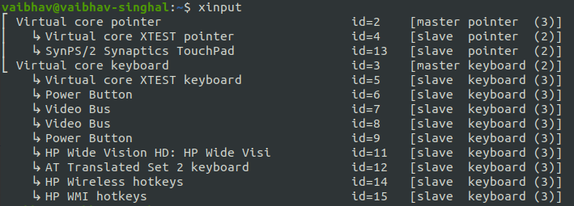
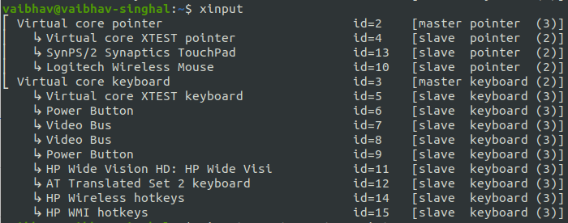
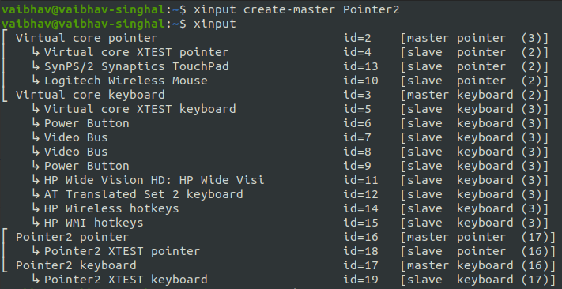
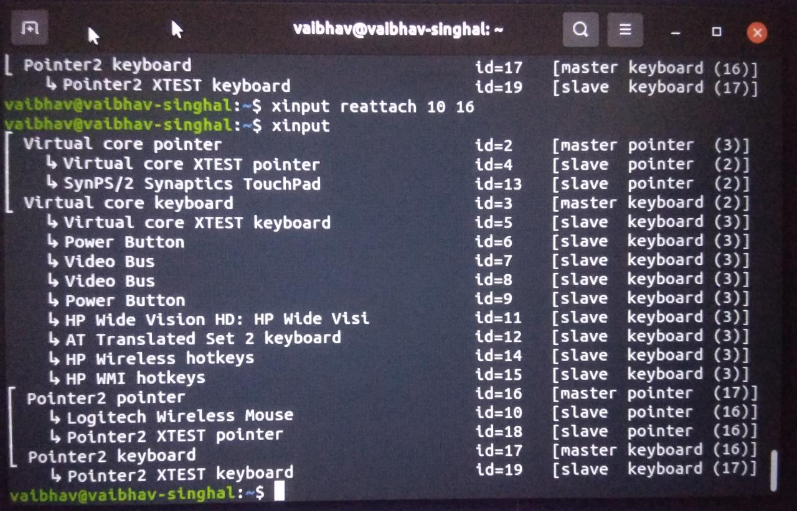
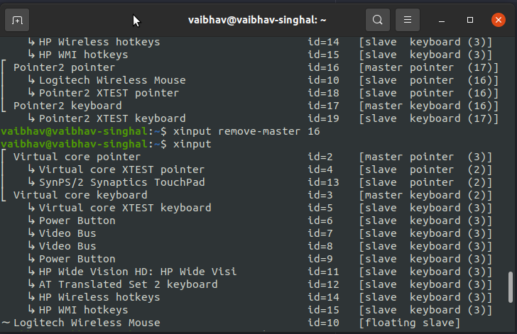
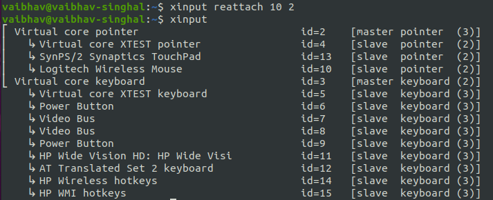

# Lab 4 Exercise
## Double mouse pointer
Before plugging the external mouse

After plugging the external mouse

Creating a new pointer

Reattaching the external mouse pointer to new pointer

Deleting the new pointer

Reattaching the external mouse pointer to original mouse pointer

