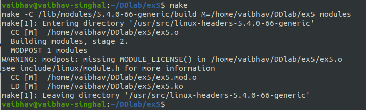
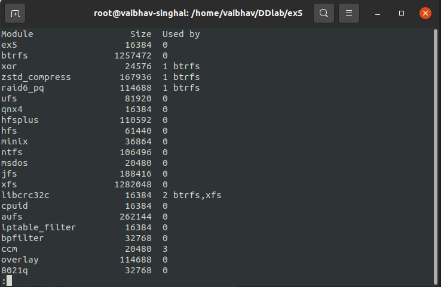
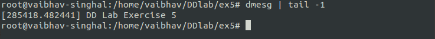
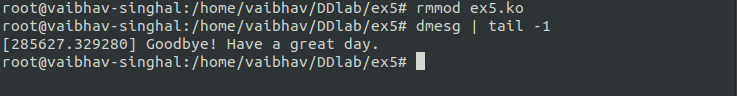
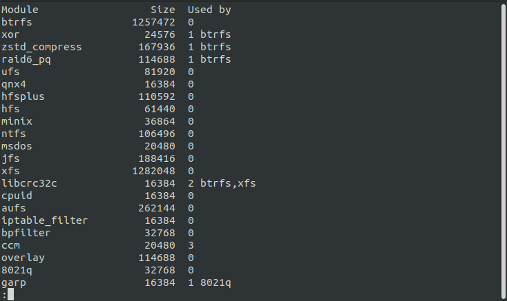

# Lab 5 Exercise
## Own Device Driver  
 to view the kernel code.  
### Output
  
Compiling the kernel code using make cmd.  
  
 to view the makefile.  
  
After inserting the module using **insmod ex5.ko** and checking whether inserted or not using **lsmod | less** command.  
  
We can see that the ex5 module is present in the list.  
  
Running **dmesg | tail -1** command to check if the entry part module is executed.  
  
  
Removing the module using **rmmod ex5.ko** and running **dmesg | tail -1** command to check if the exit part module is executed.    
  
  
Checking if the module is removed using **lsmod | less** command.    
  
We can see that the ex5 module is removed from the list.  
