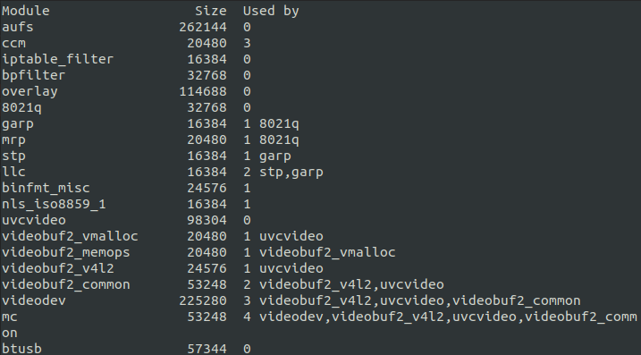

# Lab 6 Exercise
## Character Device Driver  
 to view the kernel code.  
### Output

Compiling the kernel code using make cmd.  
  
 to view the makefile.  
  
After inserting the module using **insmod ex6.ko** and checking whether inserted or not using **lsmod | less** command.
  
We can see that the ex6 module is present in the list.  
  
Checking whether the driver was registered as char driver or not using **cat /proc/devices**
  
We can see that major number 500 is assigned to my dd.  
  
In another terminal **echo "hi" > /dev/ex6** cmd was typed, after in the first terminal **dmesg** cmd was run whose output is as follows:
  
  
The module was removed after this using the **rmmod ex6** and **rm /dev/ex6** cmd. The following output is printed when **lsmod | less** command is ran.  
  
We can see that the ex6 module is removed from the list.  
