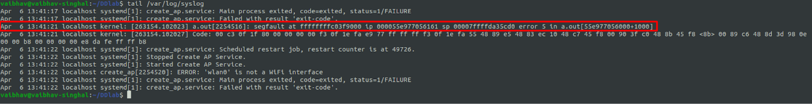

# Lab 7 Exercise
## Access Kernel memory
 to view the c program code.  
### Explanation

Using /proc/modules to display currently loaded modules in the kernel. The sixth column shows the base memory address for a module in the kernel's virtual address space. Trying to print the value at one such address by using pointers in the C code.  
  

After compiling and running the code.  
  
We can see that segmentation fault error is printed in the terminal.  

Inspecting the log files.
  
We can see that there is segfault at the address with error code = 5. The meaning is as follows:  
error 5: read from a memory area that's mapped but not readable.  
This is probably a pointer read of a pointer that is so wild that it's pointing somewhere in the kernel's area of the address space.  
