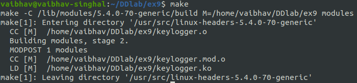
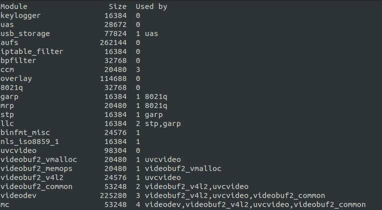
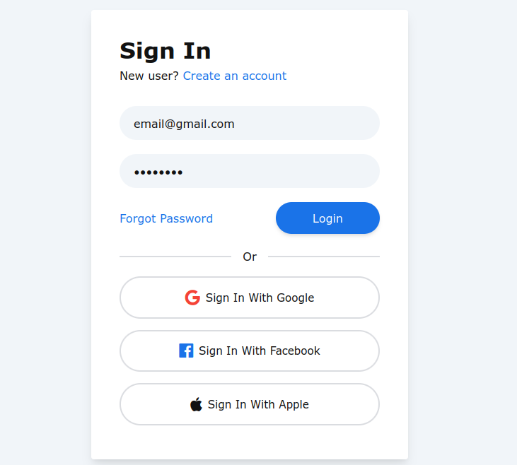
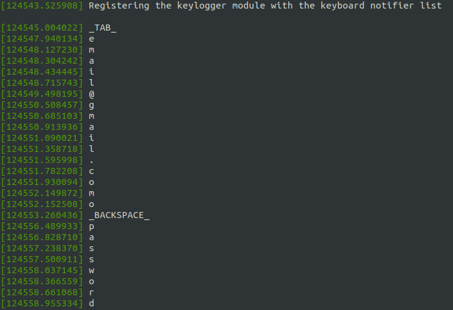
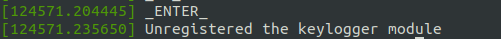
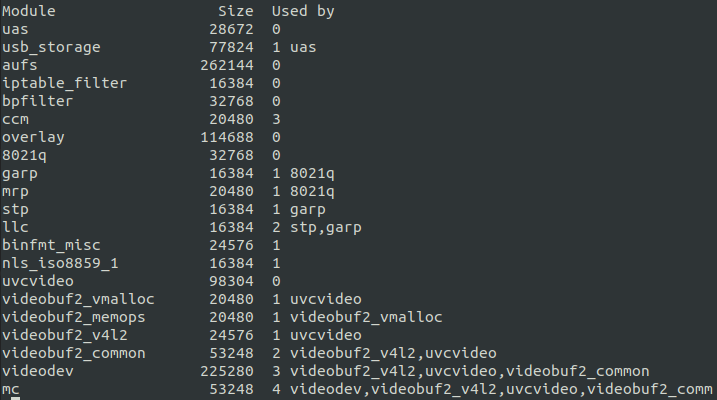

# Lab 9 Exercise
## Keyboard Logger  
 to view the kernel code.  
### Output

Compiling the kernel code using make cmd.  
  
 to view the makefile.  

After inserting the module using **insmod keylogger.ko** and checking whether inserted or not using **lsmod | less** command.  
  
We can see that the keylogger module is present in the list.  

Entering the email id and password in the login form  
  

Running **dmesg** command to check if the keystrokes are recorded.  
  
We can clearly see that the email id and password is recorded.

Removing the module using **rmmod keylogger.ko** and running **dmesg** command to check if the exit part module is executed.    
  

Checking if the module is removed using **lsmod | less** command.    
  
We can see that the keylogger module is removed from the list.  
