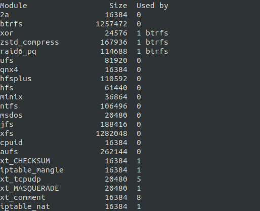
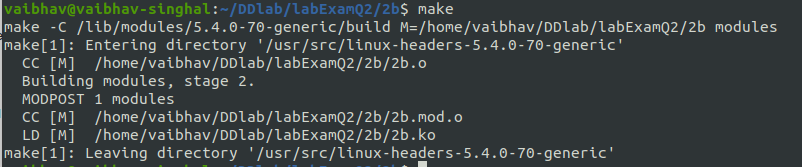

# Lab Exam Question 2

## 2a) Write a module that can take an integer parameter when it is loaded with insmod command.
 to view the kernel code.  
### Output

Compiling the kernel code using make cmd.  
  
 to view the makefile.  

Inserting the module using **insmod 2a.ko count=20**
  

Checking whether inserted or not using **lsmod | less** command.  
  
We can see that the 2a module is present in the list.  

Running **dmesg | tail -1** command to check if the entry part module is executed.  
  

Removing the module using **rmmod 2a.ko** and running **dmesg | tail -1** command to check if the exit part module is executed.    
  

Checking if the module is removed using **lsmod | less** command.    
  
We can see that the 2a module is removed from the list.  

## 2b) Write a module which prints your name in log.
 to view the kernel code.  
### Output

Compiling the kernel code using make cmd.  
  
 to view the makefile.  

After inserting the module using **insmod 2b.ko** and checking whether inserted or not using **lsmod | less** command.  
  
We can see that the 2b module is present in the list.  

Running **dmesg | tail -1** command to check if the entry part module is executed.  
  

Removing the module using **rmmod 2b.ko** and running **dmesg | tail -1** command to check if the exit part module is executed.    
  

Checking if the module is removed using **lsmod | less** command.    
  
We can see that the 2b module is removed from the list.  
